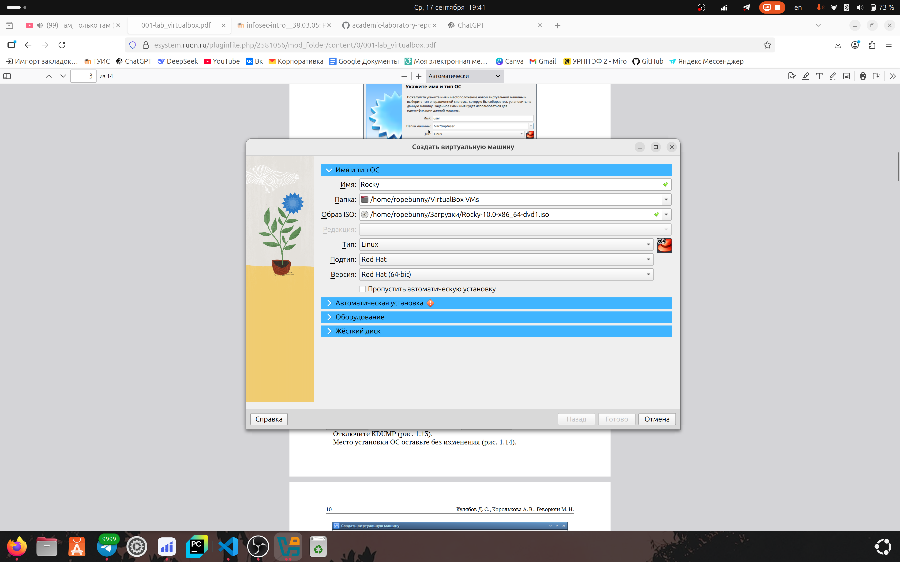
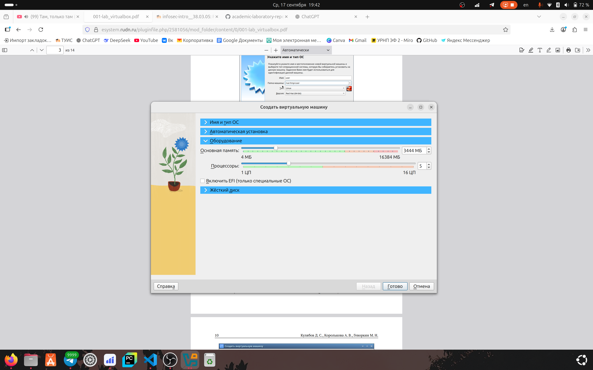
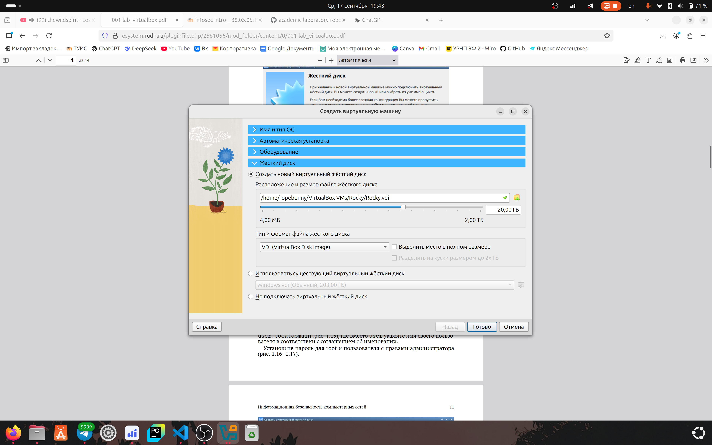
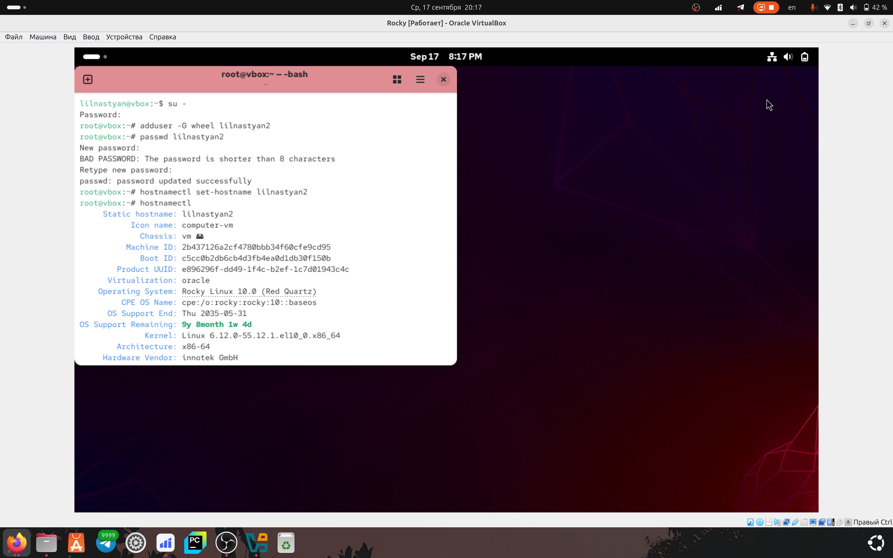
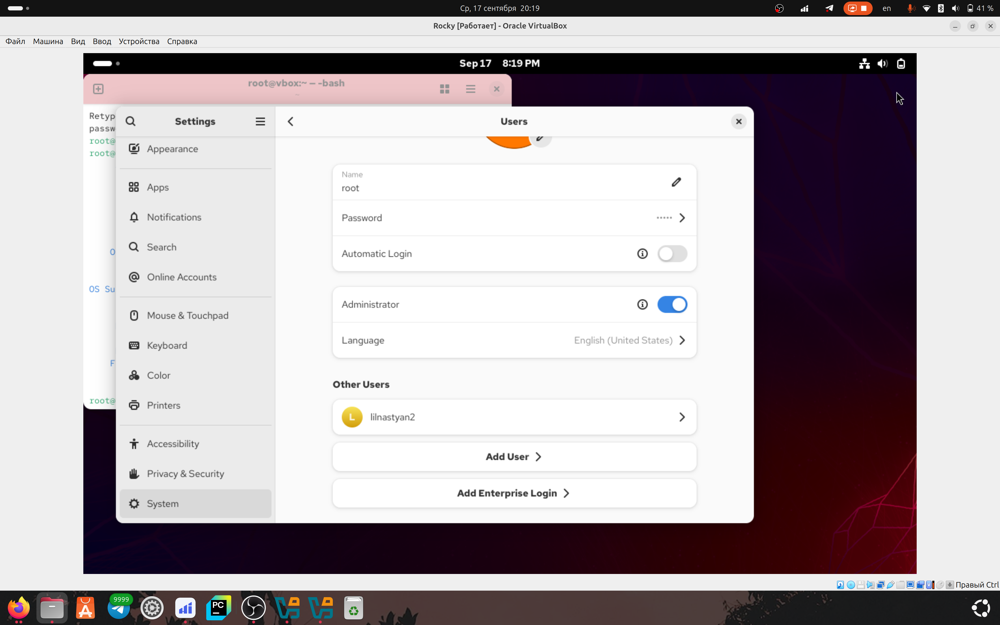

---
## Author
author:
  name: Игнатова Анастасия Александровна
  email: 1132239657@pfur.ru
  affiliation:
    - name: Российский университет дружбы народов
      country: Российская Федерация
      postal-code: 117198
      city: Москва
      address: ул. Миклухо-Маклая, д. 6

## Title
title: "Лабораторная работа №1"
subtitle: "Установка и конфигурация операционной системы на виртуальную машину"
license: "CC BY"
---

# Цель работы

Целью данной работы является приобретение практических навыков
установки операционной системы на виртуальную машину, настройки ми-
нимально необходимых для дальнейшей работы сервисов

# Задание

Установка дистрибутива Linux на вирт. машину и установка имени пользователя и названия хоста

# Выполнение лабораторной работы

1. Скачала iso-образ и начала установку на виртуальную машину

2. Установила основную память и кол-во процессоров

3. Создание нового виртуального жёсткого диска

4. Установила дистрибутив, запустила, залогинилась, запустила терминал и получила полномочия администратора. Затем создала пользователя, задала пароль для него, установила имя хоста и проверила, что имя хоста установлено верно

5. Проверила в системных настройках выполнила ли я всё верно и появился ли пользователь

# Выводы

Я научилась устанавливать на вирт. машину дистрибутив Rocky (Red Hat) и научилась базово работать с пользователями

# Контрольные вопросы

1. Какую информацию содержит учётная запись пользователя?

Учётная запись пользователя в Linux хранит:

Имя пользователя (username).

Пароль (хранится в хэшированном виде).

UID / GID (уникальные идентификаторы пользователя и группы).

Домашний каталог (home directory, например /home/username).

Оболочку (shell), которую пользователь использует (/bin/bash и т.п.).

Информацию о группе и дополнительных группах, в которые входит пользователь.

Описание пользователя (опционально, комментарий, например имя).

2. Команды терминала и примеры

a) Получение справки по команде:

man ls     
ls --help   

b) Перемещение по файловой системе:

cd /home/lilnastyan2  
cd ..               
cd ~                

c) Просмотр содержимого каталога:

ls
ls -l
ls -a

d) Определение объёма каталога:

du -sh /home/lilnastyan2

e) Создание / удаление каталогов / файлов:

mkdir new_folder          
rmdir old_folder         
rm -r folder_to_delete    
touch file.txt           
rm file.txt    

f) Задание прав на файл / каталог:

chmod 755 file.sh         
chown lilnastyan2:group file.txt

g) Просмотр истории команд:

history

3. Что такое файловая система?

Файловая система — это структура хранения и организации файлов на носителе информации. Она определяет, как данные записываются, читаются и индексируются.

Примеры:

ext4 — стандартная для Linux, надёжная, поддержка больших файлов.

NTFS — для Windows, поддержка прав доступа и больших томов.

FAT32 — старый вариант, совместим с многими ОС, но ограничение на файлы >4 ГБ.

Btrfs — современная, поддержка снапшотов, RAID, автоисправления ошибок.

4. Как посмотреть, какие файловые системы подмонтированы в ОС?

df -h          
mount          
cat /etc/fstab

5. Как удалить зависший процесс?

ps aux | grep process_name
kill (id процесса)          

# Список литературы

ТУИС