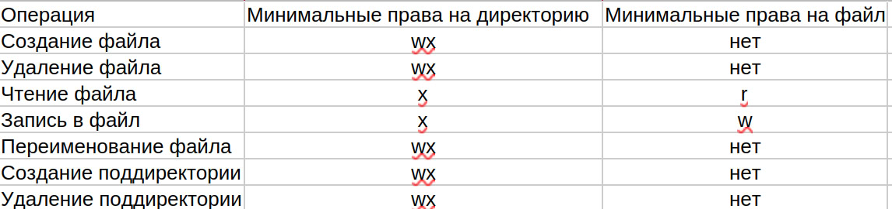

---
## Author
author:
  name: Игнатова Анастасия Александровна
  email: 1132239657@pfur.ru
  affiliation:
    - name: Российский университет дружбы народов
      country: Российская Федерация
      postal-code: 117198
      city: Москва
      address: ул. Миклухо-Маклая, д. 6

## Title
title: "Лабораторная работа №2"
subtitle: "Дискреционное разграничение прав в Linux. Основные атрибуты"
license: "CC BY"
---

# Цель работы

Получение практических навыков работы в консоли с атрибутами фай-
лов, закрепление теоретических основ дискреционного разграничения до-
ступа в современных системах с открытым кодом на базе ОС Linux

# Задание

1. В установленной при выполнении предыдущей лабораторной работы
операционной системе создайте учётную запись пользователя guest (ис-
пользую учётную запись администратора):
useradd guest
2. Задайте пароль для пользователя guest (использую учётную запись ад-
министратора):
passwd guest
3. Войдите в систему от имени пользователя guest.
4. Определите директорию, в которой вы находитесь, командой pwd. Срав-
ните её с приглашением командной строки. Определите, является ли она
вашей домашней директорией? Если нет, зайдите в домашнюю директо-
рию.
5. Уточните имя вашего пользователя командой whoami.
6. Уточните имя вашего пользователя, его группу, а также группы, куда вхо-
дит пользователь, командой id. Выведенные значения uid, gid и др. за-
помните. Сравните вывод id с выводом команды groups.
7. Сравните полученную информацию об имени пользователя с данными,
выводимыми в приглашении командной строки.
8. Просмотрите файл /etc/passwd командой
cat /etc/passwd
Найдите в нём свою учётную запись. Определите uid пользователя.
Определите gid пользователя. Сравните найденные значения с получен-
ными в предыдущих пунктах.
Замечание: в случае, когда вывод команды не умещается на одном
экране монитора, используйте прокрутку вверх–вниз (удерживая клави-
шу shift, нажимайте page up и page down) либо программу grep в
1При составлении работы использовались материалы [2—4].
Информационная безопасность компьютерных сетей 23
качестве фильтра для вывода только строк, содержащих определённые
буквенные сочетания:
cat /etc/passwd | grep guest
9. Определите существующие в системе директории командой
ls -l /home/
Удалось ли вам получить список поддиректорий директории /home? Ка-
кие права установлены на директориях?
10. Проверьте, какие расширенные атрибуты установлены на поддиректо-
риях, находящихся в директории /home, командой:
lsattr /home
Удалось ли вам увидеть расширенные атрибуты директории?
Удалось ли вам увидеть расширенные атрибуты директорий других
пользователей?
11. Создайте в домашней директории поддиректорию dir1 командой
mkdir dir1
Определите командами ls -l и lsattr, какие права доступа и расши-
ренные атрибуты были выставлены на директорию dir1.
12. Снимите с директории dir1 все атрибуты командой
chmod 000 dir1
и проверьте с её помощью правильность выполнения команды
ls -l
13. Попытайтесь создать в директории dir1 файл file1 командой
echo "test" > /home/guest/dir1/file1
Объясните, почему вы получили отказ в выполнении операции по созда-
нию файла?
Оцените, как сообщение об ошибке отразилось на создании файла? Про-
верьте командой
ls -l /home/guest/dir1
действительно ли файл file1 не находится внутри директории dir1.
14. Заполните таблицу «Установленные права и разрешённые действия»
(см. табл. 2.1), выполняя действия от имени владельца директории (фай-
лов), определив опытным путём, какие операции разрешены, а какие нет.
Если операция разрешена, занесите в таблицу знак «+», если не разре-
шена, знак «-».
Замечание 1: при заполнении табл. 2.1 рассматриваются не все атрибу-
ты файлов и директорий, а лишь «первые три»: г, w, х, для «владельца».
Остальные атрибуты также важны (особенно при использовании досту-
па от имени разных пользователей, входящих в те или иные группы).
Проверка всех атрибутов при всех условиях значительно увеличила бы
таблицу: так 9 атрибутов на директорию и 9 атрибутов на файл дают
218 строк без учёта дополнительных атрибутов, плюс таблица была бы
расширена по количеству столбцов, так как все приведённые операции
необходимо было бы повторить ещё как минимум для двух пользовате-
лей: входящего в группу владельца файла и не входящего в неё.
После полного заполнения табл. 2.1 и анализа полученных данных нам
удалось бы выяснить, что заполнение её в таком виде излишне. Можно разделить большую таблицу на несколько малых независимых таблиц.
В данном примере предлагается рассмотреть 3 + 3 атрибута, т.е. 26 = 64
варианта.
Замечание 2: в ряде действий при выполнении команды удаления файла
вы можете столкнуться с вопросом: «удалить защищённый от записи пу-
стой обычный файл dir1/file1?» Обратите внимание, что наличие этого
вопроса не позволяет сделать правильный вывод о том, что файл мож-
но удалить. В ряде случаев, при ответе «y» (да) на указанный вопрос,
возможно получить другое сообщение: «невозможно удалить dirl /file1:
Отказано в доступе».
15. На основании заполненной таблицы определите те или иные минималь-
но необходимые права для выполнения операций внутри директории
dir1, заполните табл. 2.2

# Выполнение лабораторной работы

1. Создала учётную запись guest и залогинилась в неё

 

2. Определила директорию, в которой я нахожусь. Затем зашла в домашнюю директорию и уточнила имя моего пользователя. После этого командой id уточнила другие данные о пользователе и сравнила вывод команды id с выводом команды groups. Посмотрела файл etc/passwd, нашла в нём свою учетную запись и uid, gid

3. Отфильтровала вывод командой cat /etc/passwd | grep guest. Определила существующие в системе директории. Проверила какие расширенные атрибуты установлены на поддиректориях у /home и создала в домашней директории поддиректорию dir1

4. Определила какие права доступа и атрибуты выставлены на dir1, сняла с этой директории все атрибуты и проверила правильность выполнения команды. Потом попыталась создать file1 и проверила почему не создался файл

5. Опытным путём проверила какие операции разрешены, а какие нет. Заполнила таблицу 2.1 и 2.2 с помощью этих данных

6. Таблица 2.1

7. Таблица 2.2

# Выводы

Я научилась разграничивать права в Linux дискреционно

# Список литературы

ТУИС
