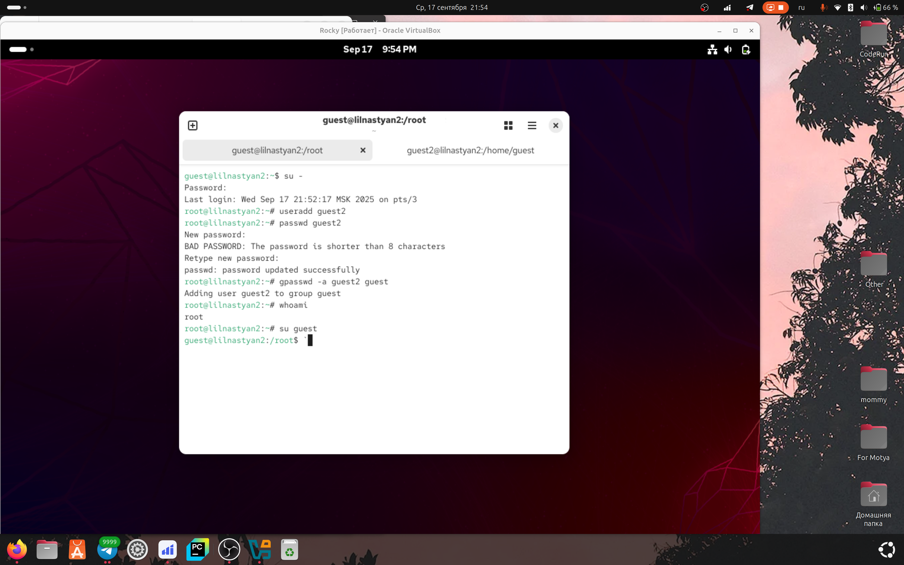
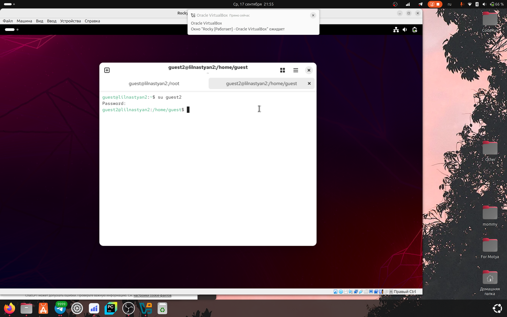
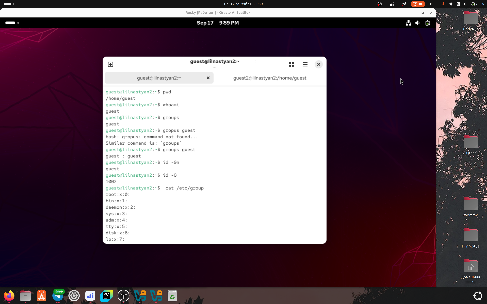
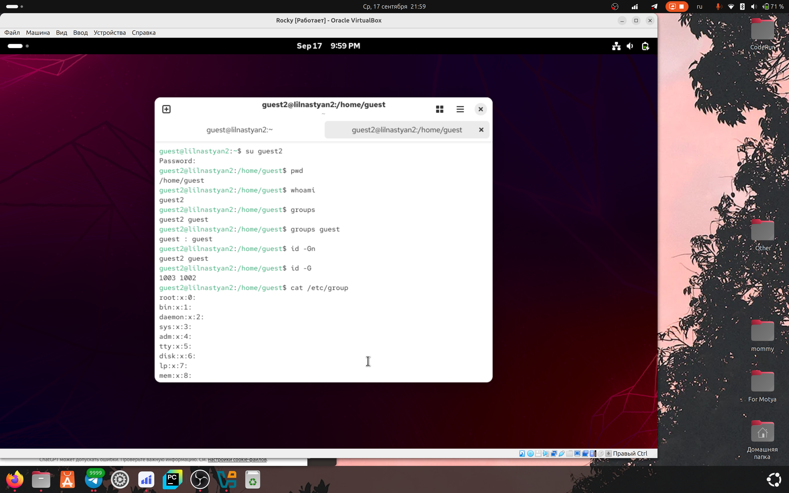
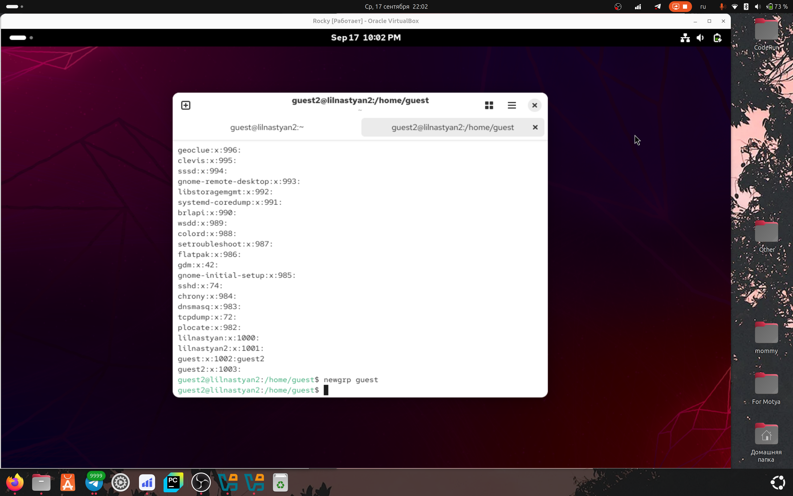
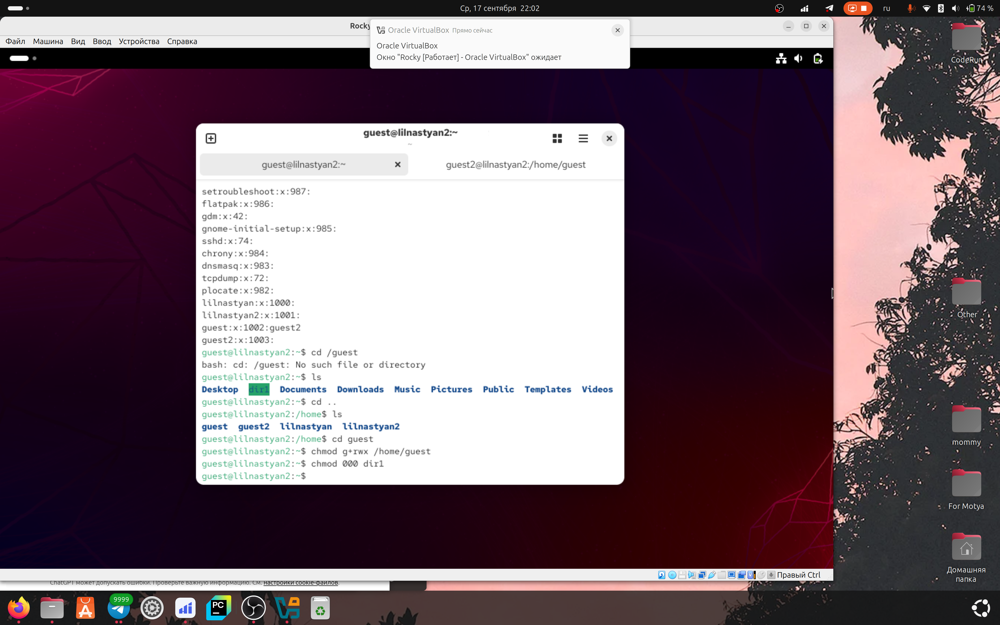
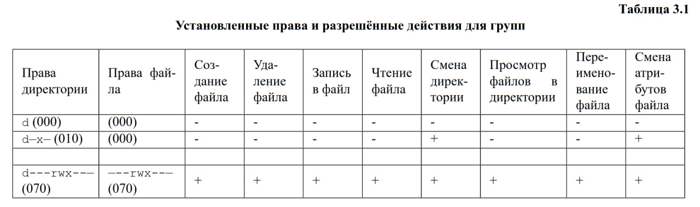

---
## Author
author:
  name: Игнатова Анастасия Александровна
  email: 1132239657@pfur.ru
  affiliation:
    - name: Российский университет дружбы народов
      country: Российская Федерация
      postal-code: 117198
      city: Москва
      address: ул. Миклухо-Маклая, д. 6

## Title
title: "Лабораторная работа №3"
subtitle: "Дискреционное разграничение прав в Linux. Два пользователя"
license: "CC BY"
---

# Цель работы

Получение практических навыков работы в консоли с атрибутами фай-
лов для групп пользователей

# Задание

1. В установленной операционной системе создайте учётную запись поль-
зователя guest (использую учётную запись администратора):
useradd guest
2. Задайте пароль для пользователя guest (использую учётную запись ад-
министратора):
passwd guest
3. Аналогично создайте второго пользователя guest2.
4. Добавьте пользователя guest2 в группу guest:
gpasswd -a guest2 guest
5. Осуществите вход в систему от двух пользователей на двух разных кон-
солях: guest на первой консоли и guest2 на второй консоли.
6. Для обоих пользователей командой pwd определите директорию, в кото-
рой вы находитесь. Сравните её с приглашениями командной строки.
7. Уточните имя вашего пользователя, его группу, кто входит в неё
и к каким группам принадлежит он сам. Определите командами
groups guest и groups guest2, в какие группы входят пользовате-
ли guest и guest2. Сравните вывод команды groups с выводом команд
id -Gn и id -G.
8. Сравните полученную информацию с содержимым файла /etc/group.
Просмотрите файл командой
cat /etc/group
9. От имени пользователя guest2 выполните регистрацию пользователя
guest2 в группе guest командой
newgrp guest
10. От имени пользователя guest измените права директории /home/guest,
разрешив все действия для пользователей группы:
chmod g+rwx /home/guest
11. От имени пользователя guest снимите с директории /home/guest/dir1
все атрибуты командой
chmod 000 dirl
1При составлении работы использовались материалы [2—4] и проверьте правильность снятия атрибутов.
Меняя атрибуты у директории dir1 и файла file1 от имени пользова-
теля guest и делая проверку от пользователя guest2, заполните табл. 3.1,
определив опытным путём, какие операции разрешены, а какие нет. Ес-
ли операция разрешена, занесите в таблицу знак «+», если не разрешена,
знак «-».
Сравните табл. 2.1 (из лабораторной работы № 2) и табл. 3.1.
На основании заполненной таблицы определите те или иные минималь-
но необходимые права для выполнения пользователем guest2 операций
внутри директории dir1 и заполните табл. 3.2.

# Выполнение лабораторной работы

1. Я создала пользователя нового guest2, добавила его в группу guest

2. Осуществила вход от имени пользователя guest2

3. Для guest: определила директорию, в которой нахожусь. Уточнила имя пользователя, в какой групее находится и кто входит. Сравнила вывод команды groups с выводом команд id -Gn и id -G

4. Для guest2: определила директорию, в которой нахожусь. Уточнила имя пользователя, в какой групее находится и кто входит. Сравнила вывод команды groups с выводом команд id -Gn и id -G

5. Добавила пользователя guest2 в группу guests

6. От имени пользователя guest изменила права директории, разрешив все действия для группы и потом сняла с директории все атрибуты

7. Таблица 3.1

8. Таблица 3.2

| Операция               | Минимальные права на директорию | Минимальные права на файл |
| ---------------------- | ------------------------------- | ------------------------- |
| Создание файла         | **wx**                          | –                         |
| Удаление файла         | **wx**                          | –                         |
| Чтение файла           | **x**                           | **r**                     |
| Запись в файл          | **x**                           | **w**                     |
| Переименование файла   | **wx**                          | –                         |
| Создание поддиректории | **wx**                          | –                         |
| Удаление поддиректории | **wx**                          | –                         |

# Выводы

Я получила навыки работы в консоли с атрибутами файлов для групп пользователей

# Список литературы

ТУИС
