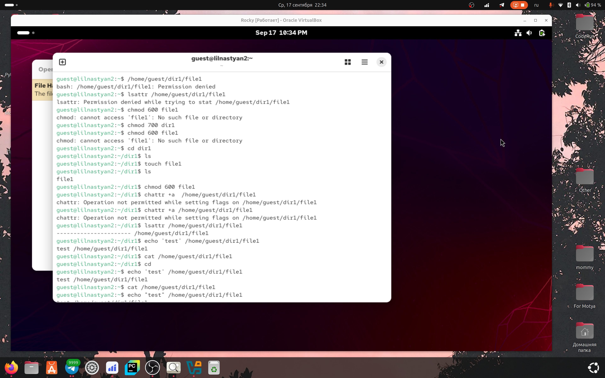
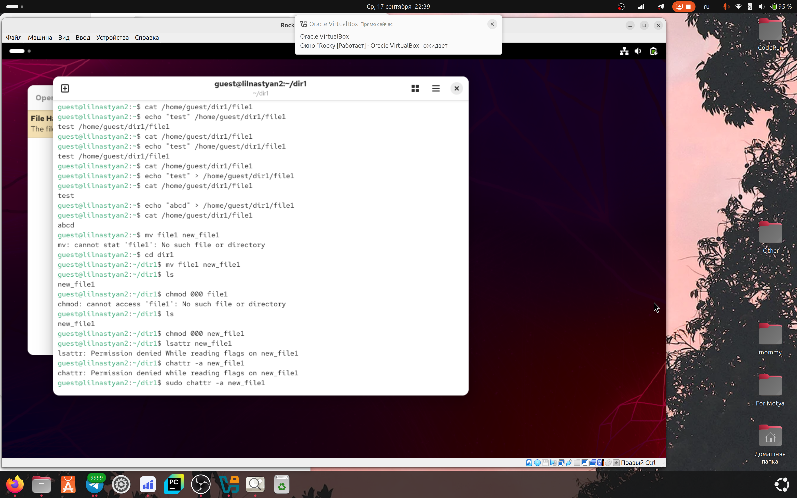
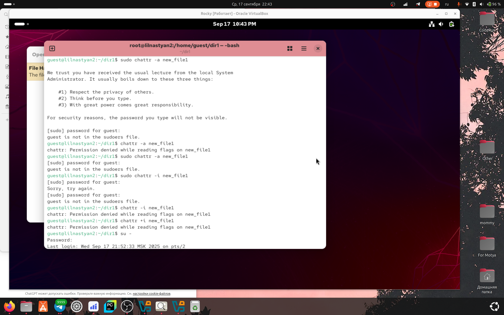
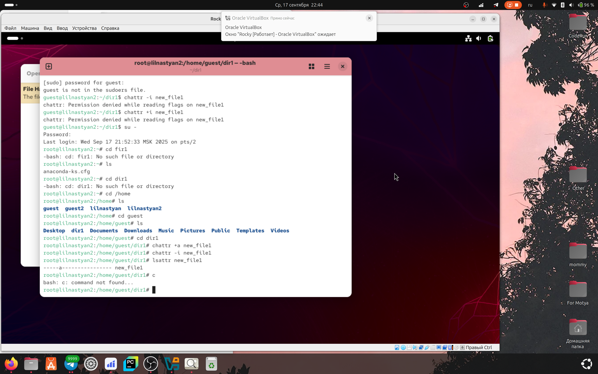

---
## Author
author:
  name: Игнатова Анастасия Александровна
  email: 1132239657@pfur.ru
  affiliation:
    - name: Российский университет дружбы народов
      country: Российская Федерация
      postal-code: 117198
      city: Москва
      address: ул. Миклухо-Маклая, д. 6

## Title
title: "Лабораторная работа №4"
subtitle: "Дискреционное разграничение прав в Linux. Расширенные атрибуты"
license: "CC BY"
---

# Цель работы

Получение практических навыков работы в консоли с расширенными
атрибутами файлов

# Задание

1. От имени пользователя guest определите расширенные атрибуты файла
/home/guest/dir1/file1 командой
lsattr /home/guest/dir1/file1
2. Установите командой
chmod 600 file1
на файл file1 права, разрешающие чтение и запись для владельца фай-
ла.
3. Попробуйте установить на файл /home/guest/dir1/file1 расширен-
ный атрибут a от имени пользователя guest:
chattr +a /home/guest/dir1/file1
В ответ вы должны получить отказ от выполнения операции.
4. Зайдите на третью консоль с правами администратора либо повысьте
свои права с помощью команды su. Попробуйте установить расширен-
ный атрибут a на файл /home/guest/dir1/file1 от имени суперполь-
зователя:
chattr +a /home/guest/dir1/file1
5. От пользователя guest проверьте правильность установления атрибута:
lsattr /home/guest/dir1/file1
6. Выполните дозапись в файл file1 слова «test» командой
echo "test" /home/guest/dir1/file1
После этого выполните чтение файла file1 командой
cat /home/guest/dir1/file1
Убедитесь, что слово test было успешно записано в file1.
7. Попробуйте удалить файл file1 либо стереть имеющуюся в нём инфор-
мацию командой
echo "abcd" > /home/guest/dirl/file1
Попробуйте переименовать файл.
8. Попробуйте с помощью команды chmod 000 file1
установить на файл file1 права, например, запрещающие чтение и за-
пись для владельца файла. Удалось ли вам успешно выполнить указан-
ные команды?
9. Снимите расширенный атрибут a с файла /home/guest/dirl/file1 от
имени суперпользователя командой
chattr -a /home/guest/dir1/file1
Повторите операции, которые вам ранее не удавалось выполнить. Ваши
наблюдения занесите в отчёт.
10. Повторите ваши действия по шагам, заменив атрибут «a» атрибутом «i».
Удалось ли вам дозаписать информацию в файл? Ваши наблюдения за-
несите в отчёт.
В результате выполнения работы вы повысили свои навыки использова-
ния интерфейса командой строки (CLI), познакомились на примерах с тем,
как используются основные и расширенные атрибуты при разграничении
доступа. Имели возможность связать теорию дискреционного разделения
доступа (дискреционная политика безопасности) с её реализацией на прак-
тике в ОС Linux. Составили наглядные таблицы, поясняющие какие опера-
ции возможны при тех или иных установленных правах. Опробовали дей-
ствие на практике расширенных атрибутов «а» и «i».

# Выполнение лабораторной работы

1. От имени пользователя guest определила расширенные атрибуты файла
/home/guest/dir1/file1 командой
lsattr /home/guest/dir1/file1. Затем установила командой chmod 600 file1 на файл file1 права, разрешающие чтение и запись для владельца фай-
ла. Попробовала установить на файл /home/guest/dir1/file1 расширенный атрибут a от имени пользователя guest:
chattr +a /home/guest/dir1/file1, получила отказ. Попробовала выполнить запись в файл, на что получен был отказ. В дальнейшем зашла с правами администратора и всё сделала

2. Записала сначала 'test', потом стерла и перезаписала данные в файле на 'abcd'. После этого переименовала файл и попробовала установить права, запрещающие чтение и за-
пись для владельца файл и попробовала снять расширенный атрибут а

3. Попробовала без прав администратора сделать что-то с атрибутами i и a, получила отказ

4. Теперь уже зашла с правами администратора и поигралась с этими атрибутами снова, всё получилось!

# Выводы

В результате выполнения работы я повысила свои навыки использования интерфейса командой строки (CLI), познакомилась на примерах с тем,
как используются основные и расширенные атрибуты при разграничении
доступа. Имела возможность связать теорию дискреционного разделения
доступа (дискреционная политика безопасности) с её реализацией на практике в ОС Linux. Составила наглядные таблицы, поясняющие какие операции возможны при тех или иных установленных правах. Опробовала действие на практике расширенных атрибутов «а» и «i»

# Список литературы

ТУИС
