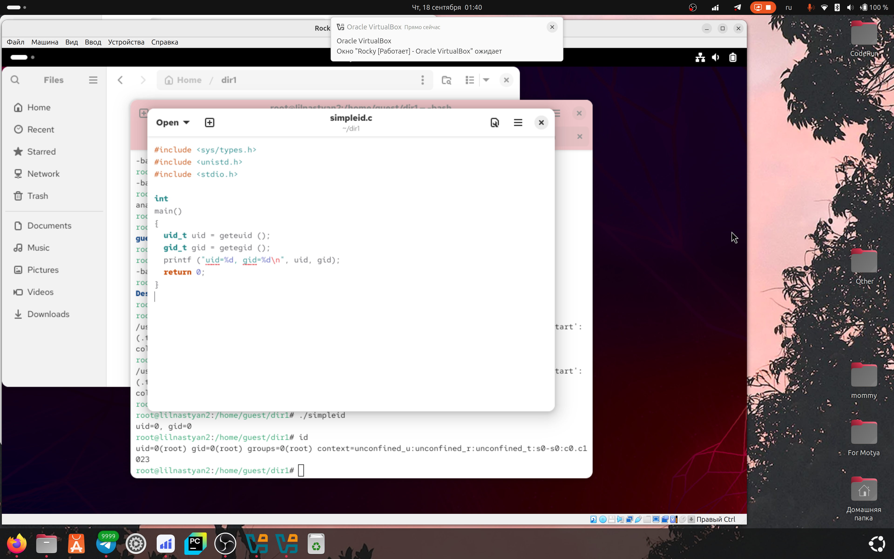
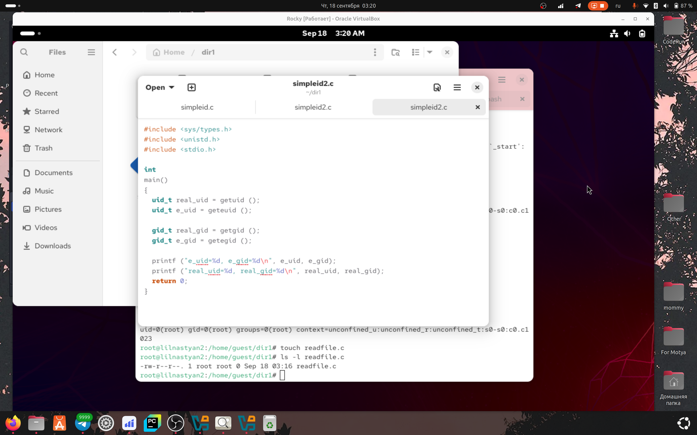
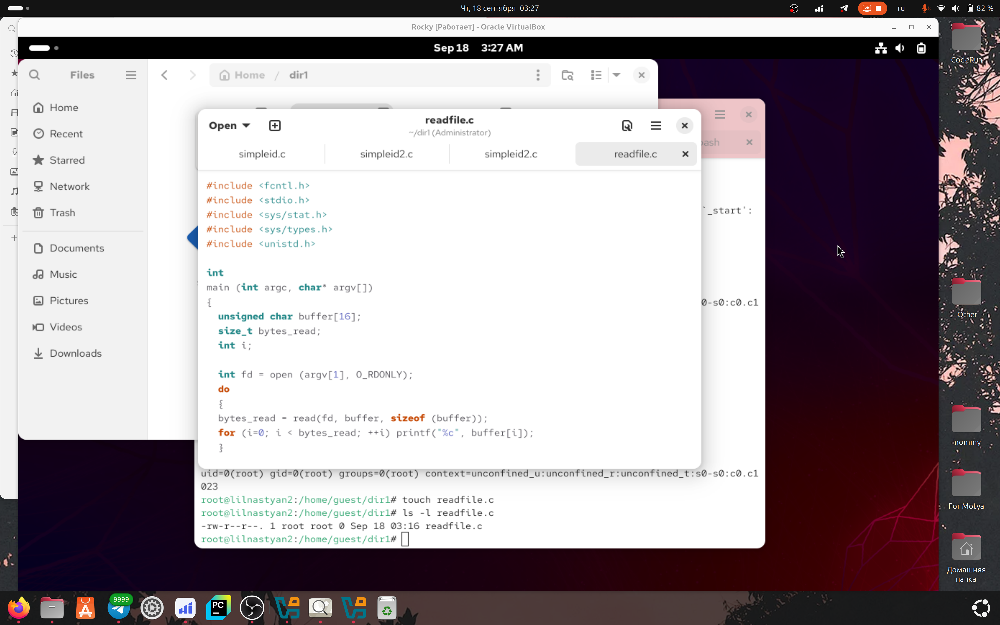
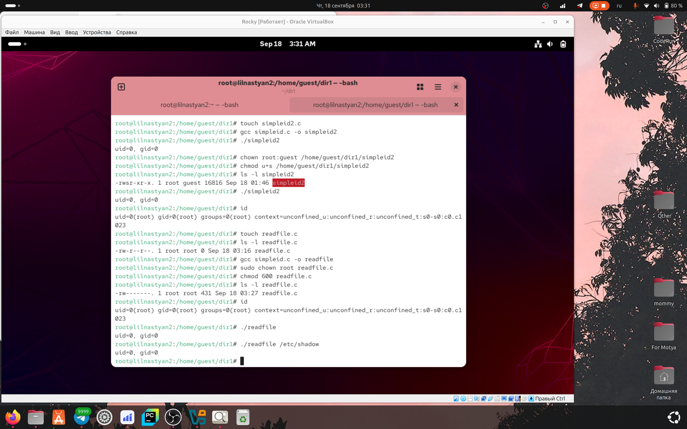
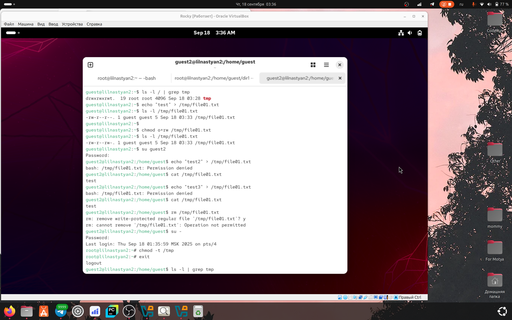
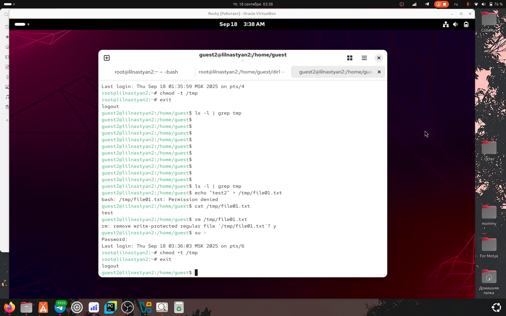

---
## Author
author:
  name: Игнатова Анастасия Александровна
  email: 1132239657@pfur.ru
  affiliation:
    - name: Российский университет дружбы народов
      country: Российская Федерация
      postal-code: 117198
      city: Москва
      address: ул. Миклухо-Маклая, д. 6

## Title
title: "Лабораторная работа №5"
subtitle: "Дискреционное разграничение прав в Linux. Исследование влияния дополнительных атрибутов"
license: "CC BY"
---

# Цель работы

Изучение механизмов изменения идентификаторов, применения
SetUID- и Sticky-битов. Получение практических навыков работы в кон-
соли с дополнительными атрибутами. Рассмотрение работы механизма
смены идентификатора процессов пользователей, а также влияние бита
Sticky на запись и удаление файлов

# Задание

1.1 Создание программы

1. Войдите в систему от имени пользователя guest.
2. Создайте программу simpleid.c:
36 Кулябов Д. С., Королькова А. В., Геворкян М. Н.
#include <sys/types.h>
#include <unistd.h>
#include <stdio.h>
int
main ()
{
uid_t uid = geteuid ();
gid_t gid = getegid ();
printf ("uid=%d, gid=%d\n", uid, gid);
return 0;
}
3. Скомплилируйте программу и убедитесь, что файл программы создан:
gcc simpleid.c -o simpleid
4. Выполните программу simpleid:
./simpleid
5. Выполните системную программу id:
id
и сравните полученный вами результат с данными предыдущего пункта
задания.
6. Усложните программу, добавив вывод действительных идентификато-
ров:
#include <sys/types.h>
#include <unistd.h>
#include <stdio.h>
int
main ()
{
uid_t real_uid = getuid ();
uid_t e_uid = geteuid ();
gid_t real_gid = getgid ();
gid_t e_gid = getegid () ;
printf ("e_uid=%d, e_gid=%d\n", e_uid, e_gid);
printf ("real_uid=%d, real_gid=%d\n", real_uid,
real_gid);↪→
return 0;
}
Получившуюся программу назовите simpleid2.c.
7. Скомпилируйте и запустите simpleid2.c:
gcc simpleid2.c -o simpleid2
./simpleid2
8. От имени суперпользователя выполните команды:
Информационная безопасность компьютерных сетей 37
chown root:guest /home/guest/simpleid2
chmod u+s /home/guest/simpleid2
9. Используйте sudo или повысьте временно свои права с помощью su.
Поясните, что делают эти команды.
10. Выполните проверку правильности установки новых атрибутов и смены
владельца файла simpleid2:
ls -l simpleid2
11. Запустите simpleid2 и id:
./simpleid2
id
Сравните результаты.
12. Проделайте тоже самое относительно SetGID-бита.
13. Создайте программу readfile.c:
#include <fcntl.h>
#include <stdio.h>
#include <sys/stat.h>
#include <sys/types.h>
#include <unistd.h>
int
main (int argc, char* argv[])
{
unsigned char buffer[16];
size_t bytes_read;
int i;
int fd = open (argv[1], O_RDONLY);
do
{
bytes_read = read (fd, buffer, sizeof (buffer));
for (i =0; i < bytes_read; ++i) printf("%c", buffer[i]);
}
while (bytes_read == sizeof (buffer));
close (fd);
return 0;
}
14. Откомпилируйте её.
gcc readfile.c -o readfile
15. Смените владельца у файла readfile.c (или любого другого текстового
файла в системе) и измените права так, чтобы только суперпользователь
(root) мог прочитать его, a guest не мог.
16. Проверьте, что пользователь guest не может прочитать файл readfile.c.
17. Смените у программы readfile владельца и установите SetU’D-бит.
18. Проверьте, может ли программа readfile прочитать файл readfile.c?
19. Проверьте, может ли программа readfile прочитать файл /etc/shadow?
Отразите полученный результат и ваши объяснения в отчёте.

1.2 Исследование Sticky-бита

1. Выясните, установлен ли атрибут Sticky на директории /tmp, для чего
выполните команду
ls -l / | grep tmp
2. От имени пользователя guest создайте файл file01.txt в директории /tmp
со словом test:
echo "test" > /tmp/file01.txt
3. Просмотрите атрибуты у только что созданного файла и разрешите чте-
ние и запись для категории пользователей «все остальные»:
ls -l /tmp/file01.txt
chmod o+rw /tmp/file01.txt
ls -l /tmp/file01.txt
4. От пользователя guest2 (не являющегося владельцем) попробуйте про-
читать файл /tmp/file01.txt:
cat /tmp/file01.txt
5. От пользователя guest2 попробуйте дозаписать в файл
/tmp/file01.txt слово test2 командой
echo "test2" > /tmp/file01.txt
Удалось ли вам выполнить операцию?
6. Проверьте содержимое файла командой
cat /tmp/file01.txt
7. От пользователя guest2 попробуйте записать в файл /tmp/file01.txt
слово test3, стерев при этом всю имеющуюся в файле информацию ко-
мандой
echo "test3" > /tmp/file01.txt
Удалось ли вам выполнить операцию?
8. Проверьте содержимое файла командой
cat /tmp/file01.txt
9. От пользователя guest2 попробуйте удалить файл /tmp/file01.txt ко-
мандой
rm /tmp/fileOl.txt
Удалось ли вам удалить файл?
10. Повысьте свои права до суперпользователя следующей командой
su -
и выполните после этого команду, снимающую атрибут t (Sticky-бит) с
директории /tmp:
chmod -t /tmp
11. Покиньте режим суперпользователя командой
exit
12. От пользователя guest2 проверьте, что атрибута t у директории /tmp
нет:
ls -l / | grep tmp
13. Повторите предыдущие шаги. Какие наблюдаются изменения?
14. Удалось ли вам удалить файл от имени пользователя, не являющегося
его владельцем? Ваши наблюдения занесите в отчёт.
Информационная безопасность компьютерных сетей 39
15. Повысьте свои права до суперпользователя и верните атрибут t на ди-
ректорию /tmp:
su -
chmod +t /tmp
exit

# Выполнение лабораторной работы

1. Я установила компилятор для с и выполнила команду setenforce 0

2. Создала файл simpleid.c

3. Вошла в систему от имени guest, скомпилировала программу, выполнила её и затем выполнила программу id, сравнивая результат между ними. 

4. Усложнила программу и создала simpleid2.c

5. Скомпилировала и запустила simpleid.c и от имени суперпользователа выполнила команды
chown root:guest /home/guest/simpleid2
chmod u+s /home/guest/simpleid2
Затем временно повысила свои права, выполнила проверку равильности установки новых атрибутов и смены владельца файла simpleid2. Потом запустила simpleid2.c b id, сравнила результаты

6. Создала программу readfile.c

7. Скомпилировала readfile.c, сменила владельца, поменяла права, проверила, что guest не может читать его, сменила у программы readfile владельца. Потом проверила может ли readfile прочитать readfile.c и /etc/shadow

8. Выяснила установлен ли атрибут Sticky и от имени пользователя guest создала файл file01.txt в tmp со словом "test". Посмотрела атрибуты у только что созданого файла и разрешила чтение и запись для категории пользователей «все остальные. Затем от пользователя guest2 попробовала дозаписать в файл "test2", проверила содержимое, попробовала записать в файл /tmp/file01.txt слово test3, стерев при этом всю имеющуюся в файле информацию и попробовала удалить файл (Ничего не получилось). 

9. После этого повысила свои права, сняла атрибут t с /tmp и повторила предыдущие шаги, стало доступно только удаление и чтение. Я удалила файл. Вернула атрибут t и понизилась обратно в права guest2

# Выводы

Я изучила механизмы изменения идентификаторов, применения SetUID- и Sticky-битов. Получила практические навыков работы в консоли с дополнительными атрибутами. Рассмотрела работы механизма
смены идентификатора процессов пользователей, а также влияние бита Sticky на запись и удаление файлов

# Список литературы

ТУИС