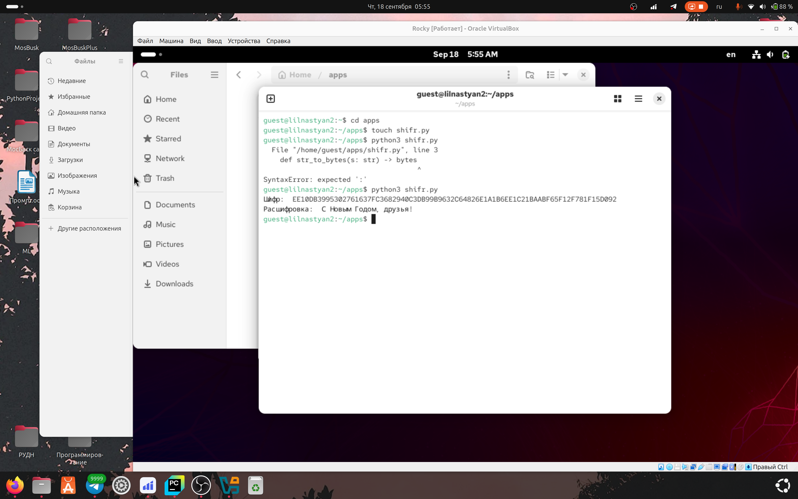

---
## Author
author:
  name: Игнатова Анастасия Александровна
  email: 1132239657@pfur.ru
  affiliation:
    - name: Российский университет дружбы народов
      country: Российская Федерация
      postal-code: 117198
      city: Москва
      address: ул. Миклухо-Маклая, д. 6

## Title
title: "Лабораторная работа №7"
subtitle: "Элементы криптографии. Однократное гаммирование"
license: "CC BY"
---

# Цель работы

Освоить на практике применение режима однократного гаммирования

# Задание

Нужно подобрать ключ, чтобы получить сообщение «С Новым Годом,
друзья!». Требуется разработать приложение, позволяющее шифровать и
дешифровать данные в режиме однократного гаммирования. Приложение
должно:
1. Определить вид шифротекста при известном ключе и известном откры-
том тексте.
2. Определить ключ, с помощью которого шифротекст может быть преоб-
разован в некоторый фрагмент текста, представляющий собой один из
возможных вариантов прочтения открытого текста.

# Теоретическое введение

Предложенная Г. С. Вернамом так называемая «схема однократного ис-
пользования (гаммирования)» является простой, но надёжной схе-
мой шифрования данных.
Гаммирование представляет собой наложение (снятие) на открытые (за-
шифрованные) данные последовательности элементов других данных, по-
лученной с помощью некоторого криптографического алгоритма, для по-
лучения зашифрованных (открытых) данных. Иными словами, наложение
гаммы — это сложение её элементов с элементами открытого (закрытого)
текста по некоторому фиксированному модулю, значение которого пред-
ставляет собой известную часть алгоритма шифрования.
В соответствии с теорией криптоанализа, если в методе шифрования ис-
пользуется однократная вероятностная гамма (однократное гаммирование)
той же длины, что и подлежащий сокрытию текст, то текст нельзя раскрыть.
Даже при раскрытии части последовательности гаммы нельзя получить ин-
формацию о всём скрываемом тексте.
Наложение гаммы по сути представляет собой выполнение операции
сложения по модулю 2 (XOR) (обозначаемая знаком ⊕) между элементами
гаммы и элементами подлежащего сокрытию текста. Напомним, как рабо-
тает операция XOR над битами: 0 ⊕ 0 = 0, 0 ⊕ 1 = 1, 1 ⊕ 0 = 1, 1 ⊕ 1 = 0.
Такой метод шифрования является симметричным, так как двойное при-
бавление одной и той же величины по модулю 2 восстанавливает исходное значение, а шифрование и расшифрование выполняется одной и той же про-
граммой.
Если известны ключ и открытый текст, то задача нахождения шифротек-
ста заключается в применении к каждому символу открытого текста следу-
ющего правила: Ci = Pi ⊕ Ki, (7.1)
где Ci — i-й символ получившегося зашифрованного послания, Pi — i-й
символ открытого текста, Ki — i-й символ ключа, i = 1, m. Размерности
открытого текста и ключа должны совпадать, и полученный шифротекст
будет такой же длины.
Если известны шифротекст и открытый текст, то задача нахождения
ключа решается также в соответствии с (7.1), а именно, обе части равен-
ства необходимо сложить по модулю 2 с Pi:
Ci ⊕ Pi = Pi ⊕ Ki ⊕ Pi = Ki,
Ki = Ci ⊕ Pi.
Открытый текст имеет символьный вид, а ключ — шестнадцатеричное
представление. Ключ также можно представить в символьном виде, вос-
пользовавшись таблицей ASCII-кодов.
К. Шеннон доказал абсолютную стойкость шифра в случае, когда одно-
кратно используемый ключ, длиной, равной длине исходного сообщения,
является фрагментом истинно случайной двоичной последовательности с
равномерным законом распределения. Криптоалгоритм не даёт никакой ин-
формации об открытом тексте: при известном зашифрованном сообщении
C все различные ключевые последовательности K возможны и равноверо-
ятны, а значит, возможны и любые сообщения P .
Необходимые и достаточные условия абсолютной стойкости шифра:
– полная случайность ключа;
– равенство длин ключа и открытого текста;
– однократное использование ключа.
Рассмотрим пример.
Ключ Центра:
05 0C 17 7F 0E 4E 37 D2 94 10 09 2E 22 57 FF C8 0B B2 70 54
Сообщение Центра:
Штирлиц – Вы Герой!!
D8 F2 E8 F0 EB E8 F6 20 2D 20 C2 FB 20 C3 E5 F0 EE E9 21 21
Зашифрованный текст, находящийся у Мюллера:
DD FE FF 8F E5 A6 C1 F2 B9 30 CB D5 02 94 1A 38 E5 5B 51 75
Дешифровальщики попробовали ключ:
05 0C 17 7F 0E 4E 37 D2 94 10 09 2E 22 55 F4 D3 07 BB BC 54
и получили текст:
D8 F2 E8 F0 EB E8 F6 20 2D 20 C2 FB 20 C1 EE EB E2 E0 ED 21
Штирлиц - Вы Болван!

# Выполнение лабораторной работы

1. Создание файла shifr.py и написание кода

2. Запуск и проверка программы

# Выводы

Я освоила на практике применение режима однократного гаммирования

# Список литературы

ТУИС