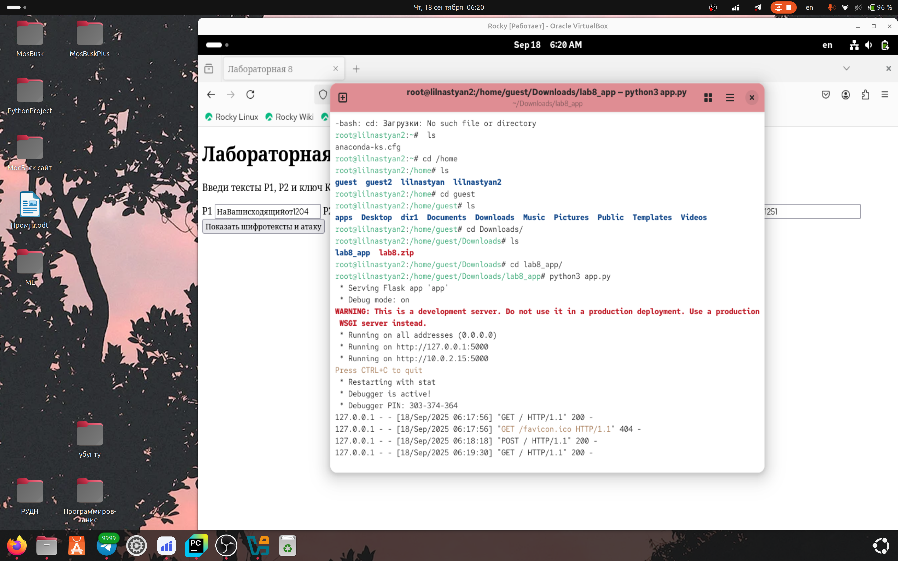
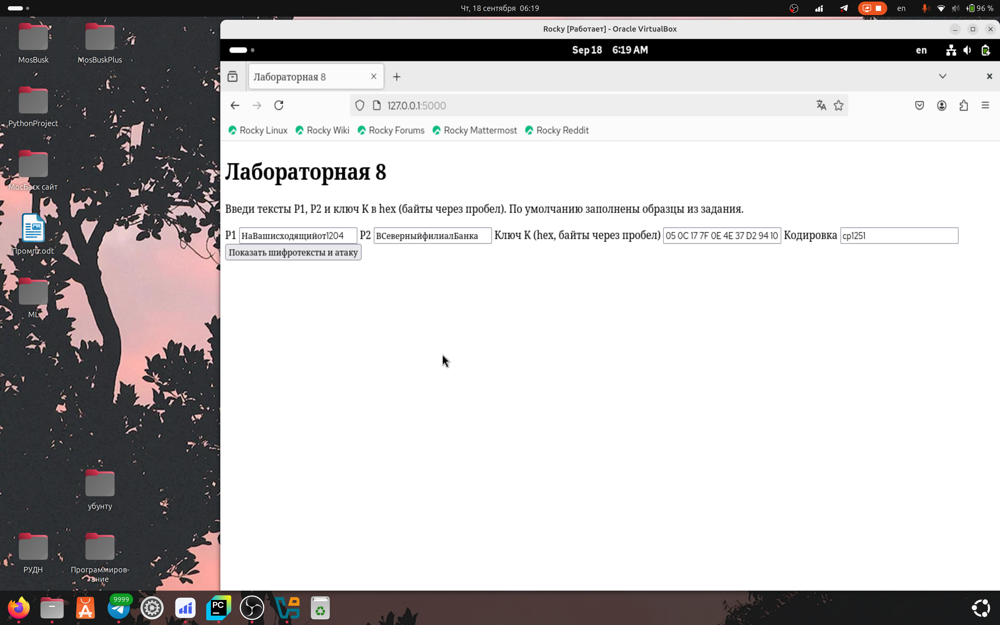
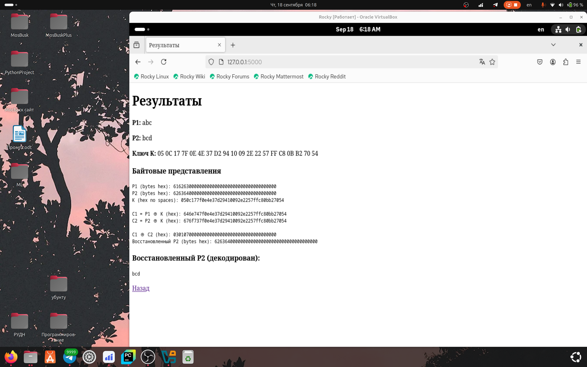

---
## Author
author:
  name: Игнатова Анастасия Александровна
  email: 1132239657@pfur.ru
  affiliation:
    - name: Российский университет дружбы народов
      country: Российская Федерация
      postal-code: 117198
      city: Москва
      address: ул. Миклухо-Маклая, д. 6

## Title
title: "Лабораторная работа №8"
subtitle: "Элементы криптографии. Шифрование (кодирование) различных исходных текстов одним ключом"
license: "CC BY"
---

# Цель работы

Освоить на практике применение режима однократного гаммирования
на примере кодирования различных исходных текстов одним ключом

# Задание

Два текста кодируются одним ключом (однократное гаммирование).
Требуется не зная ключа и не стремясь его определить, прочитать оба тек-
ста. Необходимо разработать приложение, позволяющее шифровать и де-
шифровать тексты P1 и P2 в режиме однократного гаммирования. Прило-
жение должно определить вид шифротекстов C1 и C2 обоих текстов P1 и
P2 при известном ключе ; Необходимо определить и выразить аналитиче-
ски способ, при котором злоумышленник может прочитать оба текста, не
зная ключа и не стремясь его определит

# Теоретическое введение

Исходные данные.
Две телеграммы Центра:
P1 = НаВашисходящийот1204
P2 = ВСеверныйфилиалБанка
Ключ Центра длиной 20 байт:
K = 05 0C 17 7F 0E 4E 37 D2 94 10 09 2E 22 57 FF C8 OB B2 70 54
Режим шифрования однократного гаммирования одним ключом двух
видов открытого текста реализуется в соответствии со схемой, приведён-
ной на рис. 8.1.
Шифротексты обеих телеграмм можно получить по формулам режима
однократного гаммирования:
C1 = P1 ⊕ K,
C2 = P2 ⊕ K. (8.1)
Открытый текст можно найти в соответствии с (8.1), зная шифротекст
двух телеграмм, зашифрованных одним ключом. Для это оба равенства (8.1)
Рис. 8.1. Общая схема шифрования двух различных текстов одним ключом
складываются по модулю 2. Тогда с учётом свойства операции XOR
1 ⊕ 1 = 0, 1 ⊕ 0 = 1 (8.2)
получаем: C1 ⊕ C2 = P1 ⊕ K ⊕ P2 ⊕ K = P1 ⊕ P2.
Предположим, что одна из телеграмм является шаблоном — т.е. име-
ет текст фиксированный формат, в который вписываются значения полей.
Допустим, что злоумышленнику этот формат известен. Тогда он получает
достаточно много пар C1 ⊕ C2 (известен вид обеих шифровок). Тогда зная
P1 и учитывая (8.2), имеем:
C1 ⊕ C2 ⊕ P1 = P1 ⊕ P2 ⊕ P1 = P2. (8.3)
Таким образом, злоумышленник получает возможность определить те
символы сообщения P2, которые находятся на позициях известного шаб-
лона сообщения P1. В соответствии с логикой сообщения P2, злоумышлен-
ник имеет реальный шанс узнать ещё некоторое количество символов сооб-
щения P2. Затем вновь используется (8.3) с подстановкой вместо P1 полу-
ченных на предыдущем шаге новых символов сообщения P2. И так далее.
Действуя подобным образом, злоумышленник даже если не прочитает оба
сообщения, то значительно уменьшит пространство их поиска

# Выполнение лабораторной работы

1. Написание кода приложения в pycharm на основе flask (Основной код app.py)

2. Написание кода приложения в pycharm на основе flask (Шаблон основной страницы)

3. Написание кода приложения в pycharm на основе flask (Шаблон страницы с результатами)

4. Перенос из pycharm в Rocky Linux

5. Запуск приложения на локальном сервере

6. Итог основной страницы

7. Итог страницы с результатами

# Выводы

Я освоила на практике применение режима однократного гаммирования
на примере кодирования различных исходных текстов одним ключом

# Список литературы

ТУИС
